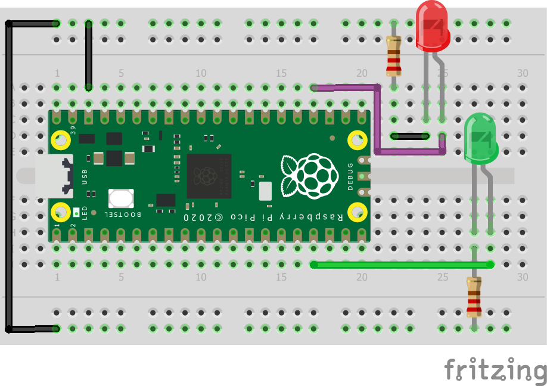
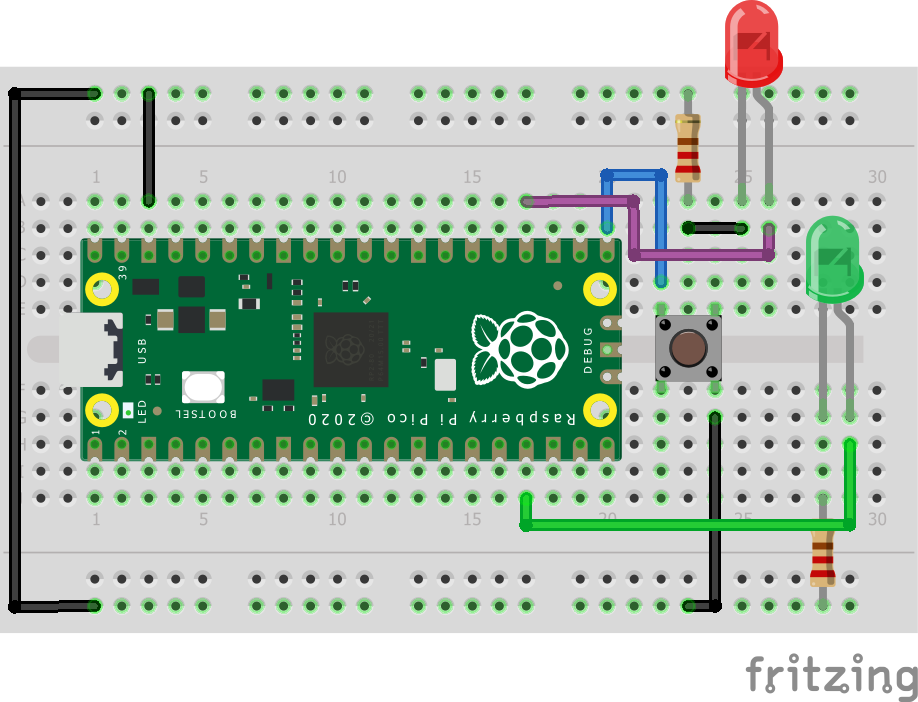
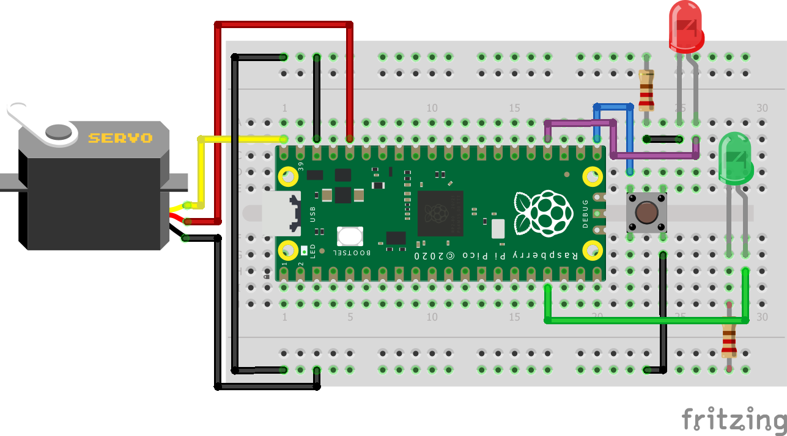
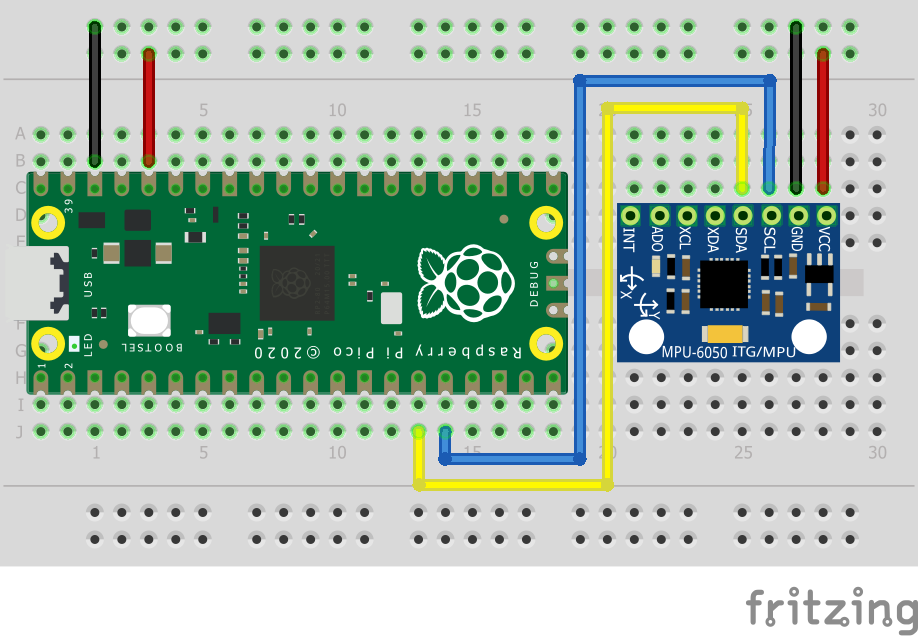
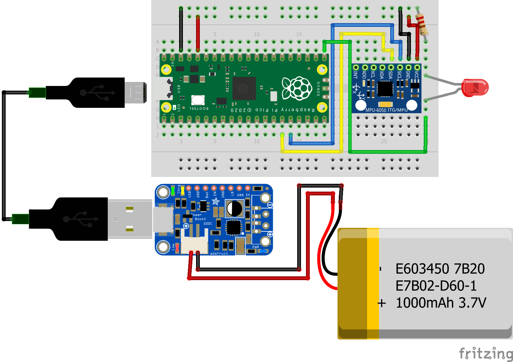
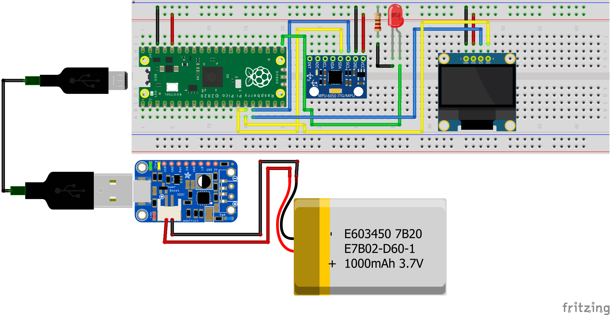
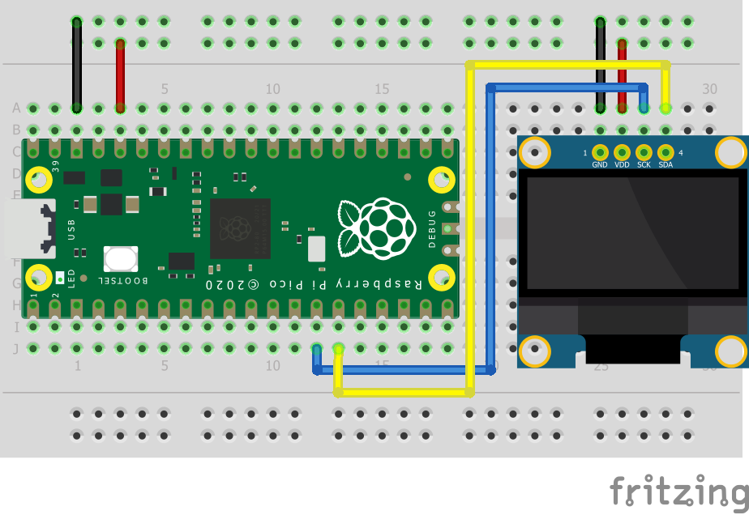
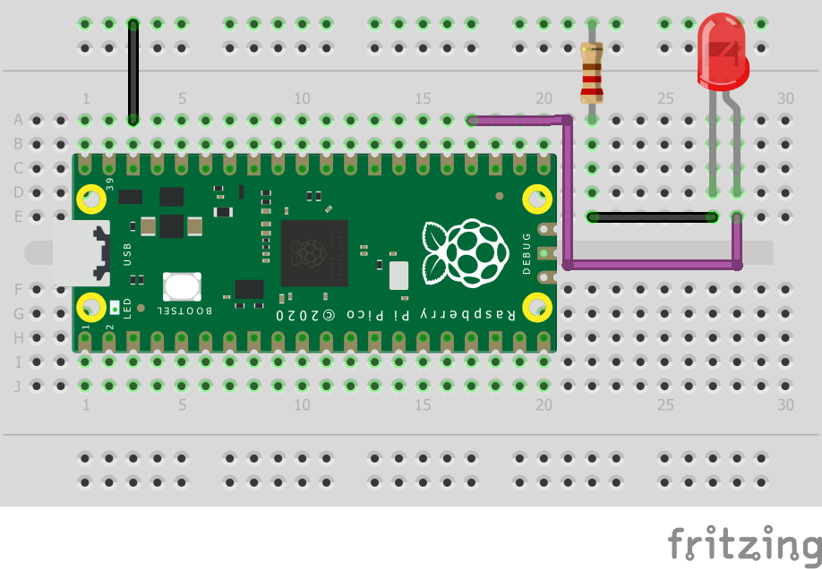
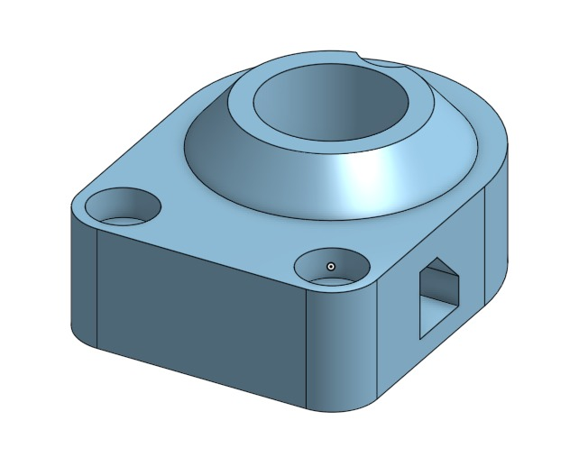
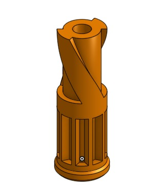

# Engineering_4_Notebook
 
 <br>

## Table of Contents

* [Launch Pad](#launch-pad)
    - [Part 1](#launch-pad-part-1)
    - [Part 2](#launch-pad-part-2)
    - [Part 3](#launch-pad-part-3)
    - [Part 4](#launch-pad-part-4)
* [Crash Avoidance](#crash-avoidance)
    - [Part 1](#crash-avoidance-part-1)
    - [Part 2](#crash-avoidance-part-2)
    - [Part 3](#crash-avoidance-part-3)
* [Landing Area](#landing-area)
    - [Part 1](#landing-area-part-1)
    - [Part 2](#landing-area-part-2)
* [Morse Code](#morse-code)
    - [Part 1](#morse-code-part-1)
    - [Part 2](#morse-code-part-2)
* [Pull Copter](#pull-copter)    
    - [Part 1 - Ring and Spinner](#ring-and-spinner)
    - [Part 2 - Key and Prop](#key-and-prop)
    - [Part 3 - Assembly](#assembly)
* [Finite Element Analysis](#finite-element-analysis)
    - [Part 1](#FEA-part-1)
    - [Part 2](#FEA-part-2)
    - [Part 3](#FEA-part-3)

<br>

# Launch Pad

You are trapped on Mars. Food is running out. The launch pad you need to launch your rocket is broken. You have limited time to repair your launch pad and get off the planet.

## Launch Pad Part 1

### Assignment Description

The first goal of the assignment was to simply count down from 10 to launch, printing to the serial monitor. 

### Evidence 


### Wiring

N/A

### Code

[Link to code](/raspberry-pi/launch_pad_pt1.py).

### Reflection

This was the first assignment of the year, and I encoutered no difficulties making it work. A simple while loop counting from 10 to zero was all that was needed. One handy trick I learned to format strings was putting an f before the string: ```f"String to format: {x}"``` Rather than using ```"{}".format(x)``` to put a variable in a string.

<br>

## Launch Pad Part 2

### Assignment Description

The second step in the launch pad was to get LEDs blinking during the countdown. A red LED blinks every second during the countdown, and then a green LED turns on at launch. 

### Evidence


### Wiring



### Code

[Link to code](/raspberry-pi/launch_pad_pt2.py)

### Reflection

Getting the LEDs to blink was a simple task. The only issue that I ran into was forgetting which LED leg went where. The answer is that the long leg goes to positive because bigger is always better.

<br>

## Launch Pad Part 3

### Assignment Description

The goal of the third assignment was to make a button start the countdown. If the button was pressed during the countdown it would be cancelled, and if it was pressed again, the countdown would restart.

### Evidence


### Wiring



### Code

[Link to code](/raspberry-pi/launch_pad_pt3.py)

### Reflection

The hardest part of this assignment was debouncing the button, which I initially forgot to do. I also tried to take the lazy approach to debouncing by using ```time.sleep()```, but I wasn't exactly successful. I eventually had to use another variable to track whether the button had been on so that it wouldn't be triggered multiple times.

<br>

## Launch Pad Part 4

### Assignment Description

The final part of the launchpad assignment was to make a servo actuate at the end of the countdown. The servo had to start moving when there were three seconds left in the countdown, and reach 180 degrees when the countdown reached zero.

### Evidence


### Wiring



### Code

[Link to code](/raspberry-pi/launch_pad_pt4.py)

### Reflection

The hardest part about getting the servo moving in time with the countdown was changing the timing scheme from ```time.sleep()``` to taking readings from ```time.monotonic()```. Although it was much more complicated, it made multitasking possible, so the servo could move while the LED was blinking without causing any troubles.

<br>

# Crash Avoidance

You are in a helicopter, and you have no idea if you're going to crash. You need to not.

## Crash Avoidance Part 1

### Assignment Description

The first part of the assignment was to wire up an accelerometer to read x, y, and z acceleration.

### Evidence


### Wiring



### Code

[Link to code](/raspberry-pi/crash_avoidance_pt1.py)

### Reflection

I didn't run into any issues, and because of my excellent programming, neither did the theoretical helicopter. One handy tool that I used in the assignment was the ```round()``` function. This function does exactly what it says - rounding the first number put into it to the number of digits of the second number put into it. For example ```round(15.2728, 2)``` would produce ```15.27```. 

<br>

## Crash Avoidance Part 2

### Assignment Description

After successfully setting up an accelerometer, the next step was to use those acceleration values to trigger a warning light if the helicopter is tilted at 90 degrees. Additionally, a battery will set up your RPi Pico to run “headless” (not attached to a computer).

### Evidence


### Wiring



### Code

[Link to code](/raspberry-pi/crash_avoidance_pt2.py)

### Reflection

The hardest part of this assignment was figuring out the values for when the accelerometer was perpendicular to the ground. It was mostly trial and error. Cheers.

<br>

## Crash Avoidance Part 3

### Assignment Description

After successfully setting up an accelerometer and making your device mobile. The next step is to add an onboard OLED screen to print live angular velocity values.

### Evidence


### Wiring



### Code

[Link to code](/raspberry-pi/crash_avoidance_pt3.py)

### Reflection

I ran into some issues with a broken OLED screen, which were quickly resolved with I found a funcioning OLED screen. Additionally, there were some problems with I2C communication. I tried to have two I2C devices on 2 different sets of SDA and SCL pins, which caused some problems. This was fixed by using the same 2 SDA and SCL pins for the different devices.

<br>

# Landing Area

NASA is preparing to send a mission to replace the equipment that was damaged in the solar flare. The landing areas need to be large, as the equipment will deorbit and tumble to a stop. The helicopter will be utilized to scout potential landing sites for the recovery mission. The helicopter seeks out open areas of land in triangular shapes, and it is up to your team to determine the best landing site. Your base commander has asked you to code an automated system to determine the best landing site from sets of three coordinates. 

## Landing Area Part 1

### Assignment Description

Write a script that takes three coordinates and returns the area using a function (see detailed list of requirements below).

### Evidence


### Wiring

N/A

### Code

[Link to code](/raspberry-pi/landing_area_pt1.py)

### Reflection

I had to relearn how to use the [split function](https://www.w3schools.com/python/ref_string_split.asp). By default, it splits a string into words with a space indicating the start of a word. However, you can specify the seperation character so I used it to split the coordinate inputs by setting the character to ```','```.

<br>

## Landing Area Part 2

### Assignment Description

You have successfully written a script to calculate and return the area of each triangle. Now, your commander has asked that you include a small OLED screen to improve visualization of where the landing area is relative to the base.

### Evidence


### Wiring



### Code

[Link to code](/raspberry-pi/landing_area_pt2.py)

### Reflection

The hardest part of graphing the triangle was that the input coordinates had to be translated to the coordinate system of the OLED screen. The OLED screen starts the x and y at 0 in the top left corner - increasing in number going to the right and down. To translate these coordinates so that the origin is in the center, I had to add 64 to the x, and add 32 to *negative* y so that y decreases as it goes down.

<br>

# Morse Code

## Morse Code Part 1

### Assignment Description

Write a morse code translator (see the introduction page for more info on morse code). This piece of code will translate text from the user into a set of dots and dashes. Print those dots and dashes to the serial monitor.

### Evidence


### Wiring

N/A

### Code

[Link to code](/raspberry-pi/morse_code_pt1.py)

### Reflection

This was the first time in this class that we used a dictionary in an assignment. [Dictionaries](https://www.w3schools.com/python/python_dictionaries.asp) are a very good way to store relationships between pieces of data. In this assignment, a dictionary was used to quickly and easily translate characters to morse code.

<br>

## Morse Code Part 2

### Assignment Description

Now that you have a script that translates English into Morse Code, let’s add to it! You need to have your Pico flash out your Morse Code message using an LED.

### Evidence


### Wiring



### Code

[Link to code](/raspberry-pi/morse_code_pt2.py)

### Reflection

Wow! Making an LED blink! How sophisticated and difficult! In all seriousness I didn't really have any problems other than needing to find the [morse code](https://morsecode.world/international/morse.html) values for punctuation.

<br>

# Pull Copter

## Ring and Spinner

### Assignment Description

This assignment was a collaboration between two students (thanks [Em](https://github.com/hheisig51)), with each student creating half of the parts. In the first part, Student A created the top, and Student B created the spinner. 

### Part Link 

[Onshape document](https://cvilleschools.onshape.com/documents/42937f422f88d8bb3d6f1868/w/4a524ad086e734c682d1f232/e/8a1a2adf66bb568d7e1749f7?renderMode=0&uiState=6373b0ea18c6542b9472d154)

### Part Image




### Reflection

TODO